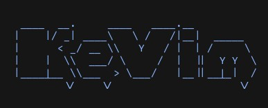

# KeVim - The Kevin Neovim

This is my personal neovim config. It uses lazy.nvim to manage plugins.

## Requirements

- Use of treesitter requires a C compiler installation as well as the treesitter CLI
  - This isn't super obvious especially because parser compilation **does not** throw an error when these aren't present
- Everything else should be addressed with `checkhealth`

## Recommended Language Servers

I don't really prescribe LSPs with the config files because projects are variable and I like trying new ones every so
often, so here are the ones I generally use:

### Python

- ruff (linting, formatting)
- ty (type checking, completions)

### Typescript

- biome (linting, formatting)
- typescript-language-server (type checking, completions)

### Misc

- bash-language-server
- lua-language-server
- marksman (or rumdl for new projects)
- typos-lsp (low-false-positive spellcheck)
- json-lsp
- yaml-language-server
